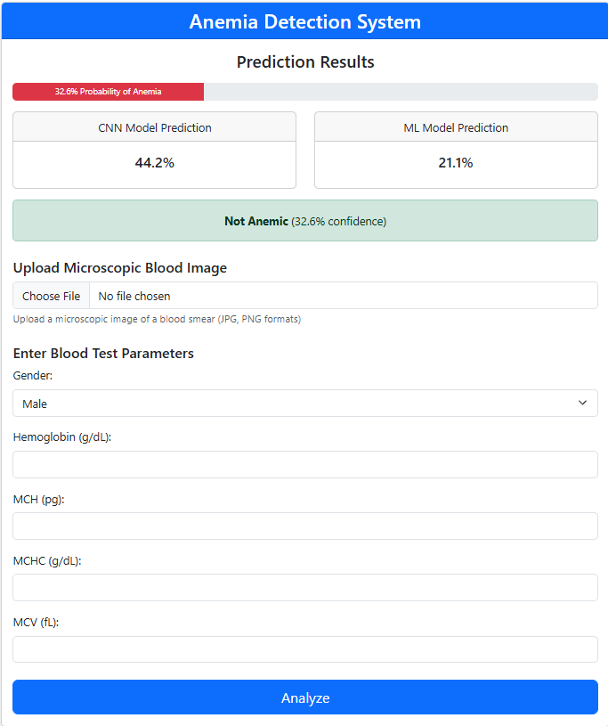

# Anemia Detection Project

A web-based anemia prediction project that combines deep learning feature extractors with classical ML models in an ensemble pipeline.

## Project Highlights
- Flask web app for image-based prediction
- Ensemble inference using multiple models
- Local inference setup (no external API required)
- Git LFS configured for large model assets (`*.h5`, `*.pkl`)

## UI Showcase
### Project Interface


## Folder Structure
```text
ANEMIA DETECTION PROJECT/
├─ app.py
├─ ensemble.py
├─ templates/
├─ static/
├─ *.h5
├─ *.pkl
├─ pyproject.toml
└─ uv.lock
```

## Run With `uv`
1. Open terminal in the project folder.
2. Sync dependencies:
```bash
uv sync
```
3. Run the app:
```bash
uv run python app.py
```
4. Open:
```text
http://127.0.0.1:5000
```

## Notes
- If you see `Could not import PIL.Image`, install Pillow:
```bash
uv add pillow
```
- Keep model files tracked with Git LFS when updating weights.

## Tech Stack
- Python
- Flask
- TensorFlow / Keras
- scikit-learn
- NumPy / Pandas

## Author
Rithik
